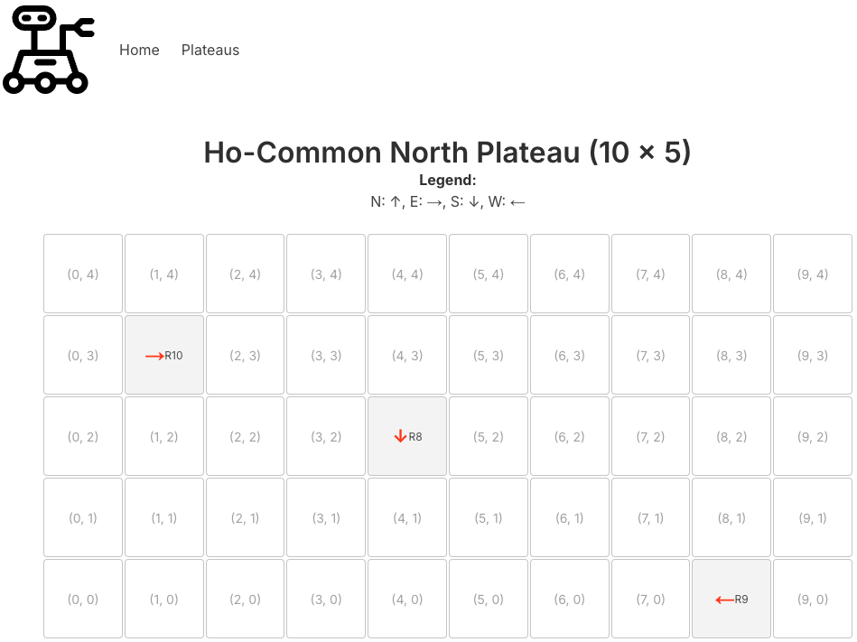
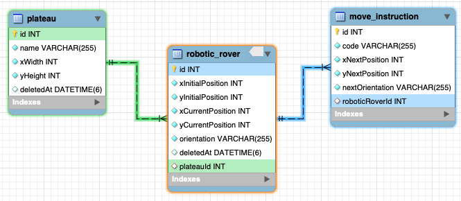

# Voyager Rover Test

 

NASA deploys rovers to explore a rectangular plateau on Mars. Each rover starts at a specified grid coordinate with a compass direction (e.g., 1, 3, N). NASA controls rovers with commands: 'L' and 'R' to turn left or right, and 'M' to move forward. Input includes plateau size, each rover's start position, and movement instructions, with output showing the final grid position and heading after completing its commands. Multiple rovers and plateaus are supported!

---

### Non Functional Requirements

This app is built with a multi-tier architecture with distinct layers for the database, backend API, and frontend web interface.

- All data input should be done via the [user interface](./packages/robotic-rovers-web/).
- Backend to be [built as an API](./packages/robotic-rovers-api/)
- Whole project to [run on Docker](./docker-compose.yaml)
- Clear and detailed documentation on how to [run the project](#running-locally)
- Use [MySQL database](#mysql-database) to store the app data

The main idea here is to separate responsibilities across three key services.

- The frontend focuses on the user experience and interface.
- The backend manages data and application logic.
- The database is solely responsible for data storage and retrieval.

---

### Running Locally

Clone the repository and run docker compose to initialize the application services:

```sh
$ git clone git@github.com:allisonmachado/voyager-rover-test.git
$ cd /voyager-rover-test.git
$ docker-compose up
```

That is enough to have the application running and accessible via `http://localhost:3000/`. 
As a bonus, a simple swagger documentation for the exposed API is accessible via `http://localhost:3001/documentation`.

For code editing with IDE integration it's recommended to use Visual Studio Code with the [Dev Containers extension](https://marketplace.visualstudio.com/items?itemName=ms-vscode-remote.remote-containers) lets you use the Docker containers as reproducible development environments.

If you need to install new dependencies or perform changes outside the `packages/**/src/**` (e.g.: change environment variables), you'll need to rebuild the images:

```sh
docker compose down --rmi all
```

And then restart the services:

```sh
docker-compose up
```

---

### MySQL database

The database entities are defined according to the following ERD:



TypeORM is used as the backend ORM layer and takes care of synchronizing the [entity definitions](./packages/robotic-rovers-api/src/entities/) into the database table structures.

#### Sample Queries (Bonus)

##### list robots by longest distance traveled
```sql
select
  concat('R', rob.id) as robot
  , count(mov.id) distanceUnits
from robotic_rover rob
left join move_instruction mov on (
  mov.roboticRoverId = rob.id
  and mov.code = 'M'
)
where 
  rob.deletedAt is null
group by rob.id
order by distanceUnits desc
;
```

##### list plateaus by number of rovers
```sql
select
  pla.id as plateauId
  , pla.name as plateauName
  , count(rob.id) as roversCount
from plateau pla
left join robotic_rover rob on rob.plateauId = pla.id
where 
  pla.deletedAt is null
  and rob.deletedAt is null
group by pla.id
order by roversCount desc
;
```

##### list plateaus by total area
```sql
select
  pla.id as plateauId
  , pla.name as plateauName
  , pla.xWidth * pla.yHeight as totalArea
from plateau pla
where 
  pla.deletedAt is null
order by totalArea desc
;
```

---

Crafted with dedication by [Allison Machado Gonçalves](https://allison.bsb.br).
          